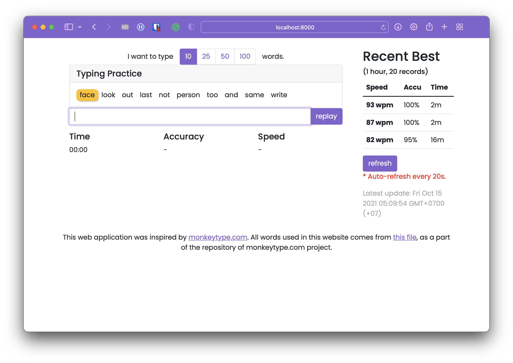
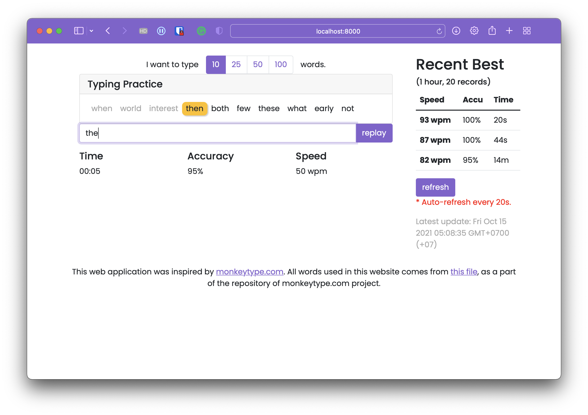
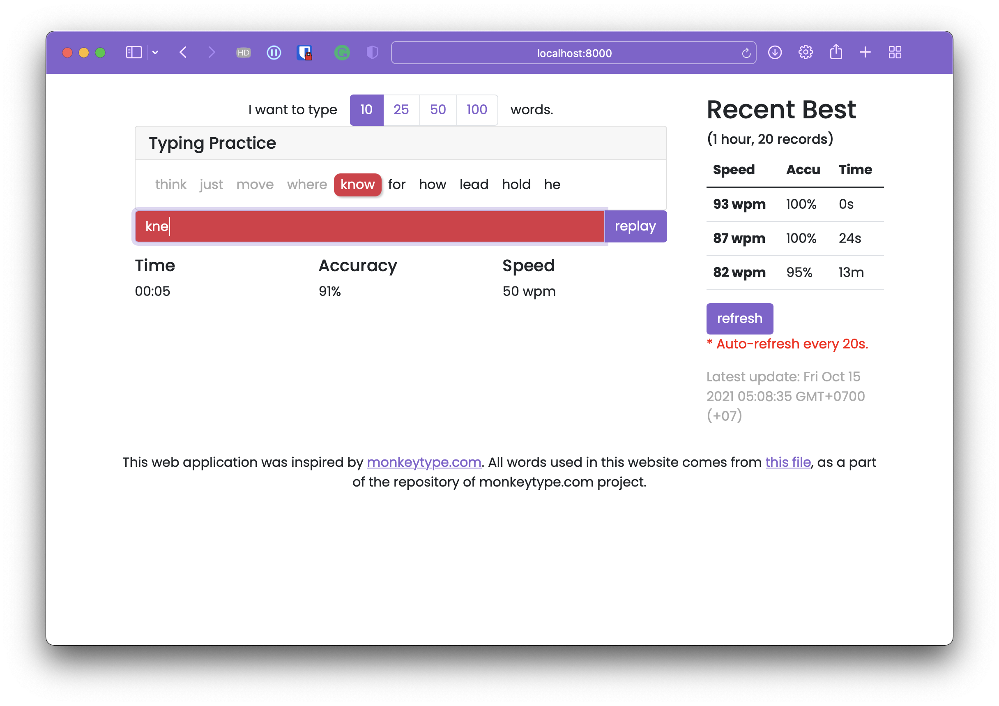
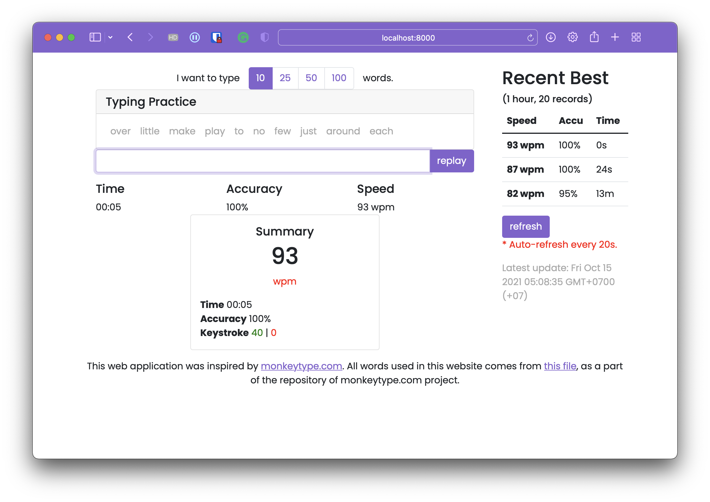

# Overview

This web application is a typing practice platform inspired by [Monkeytype](https://monkeytype.com) and
[10fastfingers](https://10fastfingers.com). The purpose is to demonstrate the overall interaction between the front-end
side (developed using [React.js](https://reactjs.org)) and back-end side (developed in [Django](https://www.djangoproject.com)
with [REST Framework](https://www.django-rest-framework.org)).

# Setup Guide

Before you begin, make sure to have all the **minimum prerequisites** prepared.

- The latest version of [Python 3](https://www.python.org).
- [Django 3](https://www.djangoproject.com/download/) (in this project, the version 3.2.8 is used)

If you wish to modify the front-end side, you will need to install the required programs below. Otherwise,
you can run the server without any problems.

- [node.js](https://nodejs.org/en/) (recommended version: 12 LTS)
- npm or [yarn](https://yarnpkg.com) (yarn is more preferred in terms of performance)

After installing necessary programs, we can now start the web server in the following steps.

1. Make sure that the current directory (in your terminal) is at the root directory of the project. (at where `manage.py` is)
2. Run `python manage.py runserver`
3. Open [http://localhost:8000](http://localhost:8000) or [http://127.0.0.1:8000](http://127.0.0.1:8000) in a browser.

If everything goes right, this will be the website we can expect to see.

In case you want to modify the front-end side,

1. Go to the `frontend` directory.
2. Run `yarn` or `npm install` to install the required dependencies used within the frontend.
3. Run `yarn run dev` or `npm run dev` to start the [webpack](https://webpack.js.org) file watcher. This will automatically
rebuild the web pages every time you make changes to any files related to frontend.
4. To make a production build, run `yarn run build` or `npm run build`.

# How to use

You may start typing at any particular time within the textbox to begin the timer and typing process.

When typing, the real-time accuracy rate and speed will be displayed as follows.

If users misspells, some UI components will turn red to let user know.

After finishing, the summary will appear. The information within the summary will be submitted to the server as well as
the scoreboard on the right.

